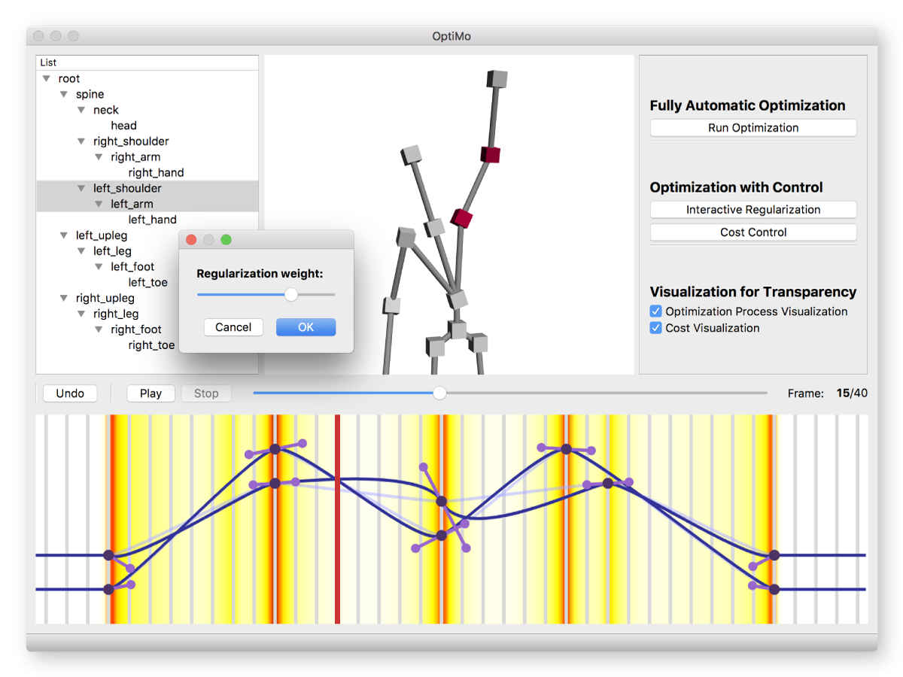

# OptiMo

OptiMo is an "optimization-guided motion editing" system for authoring 3D character animations. OptiMo allows animators to effectively utilize the power of numerical optimization while keeping appropriate control.



## Dependencies

### Not included

- Eigen <http://eigen.tuxfamily.org/>
- Qt5 <http://doc.qt.io/qt-5/>
- OpenGL <https://www.opengl.org/>
- GLUT <https://www.opengl.org/resources/libraries/glut/>

### Included via gitsubmodule

- NLopt <https://nlopt.readthedocs.io/>
- json11 <https://github.com/dropbox/json11>
- tinycolormap <https://github.com/yuki-koyama/tinycolormap>
- nlopt-util <https://github.com/yuki-koyama/nlopt-util>
- three-dim-util <https://github.com/yuki-koyama/three-dim-util>
- parallel_util <https://github.com/yuki-koyama/parallel_util>

### Included directly

- RBDL <https://bitbucket.org/rbdl/rbdl/> (their source codes for `v2.5.0` are included in this repository)

## Compilation Instruction

CMake <https://cmake.org/> is used for managing source codes. OptiMo can be built by, for example, 
```
git clone https://github.com/yuki-koyama/optimo.git --recursive
cd optimo
mkdir build
cd build
cmake ../
make
```

Note that the necessary third-party libraries (i.e., Eigen, NLopt, and Qt5) should be installed before building OptiMo. If you use macOS and `brew`, you can easily install them by
```
brew install eigen qt5
```

Note that you might need to specify `CMAKE_PREFIX_PATH` adequately so that CMake can find Qt5.

## Known Issues (Need Help!)

OptiMo is currently tested on macOS only. It is possible that OptiMo could not be built or run with other platforms such as Windows or Linux. Pull request welcome.

## Publication

Yuki Koyama and Masataka Goto. 2018. OptiMo: Optimization-Guided Motion Editing for Keyframe Character Animation. In Proceedings of 2018 CHI Conference on Human Factors in Computing Systems (CHI '18), pp.161:1--161:12. DOI: <https://doi.org/10.1145/3173574.3173735>

## Project Web Page

<http://koyama.xyz/project/optimo/>

## Licensing

OptiMo is dual-licensed; You may use OptiMo under either *LGPLv3* or *our commercial license*. See the `LICENSE` files for details.

## Contributing

Pull requests are highly welcome. Please be aware that any contribution to this repository will be licensed under the above license condition.

## Authors

- Yuki Koyama
- Masataka Goto

## Copyright

Copyright (c) 2018 National Institute of Advanced Industrial Science and Technology (AIST) - <koyama.y@aist.go.jp>
